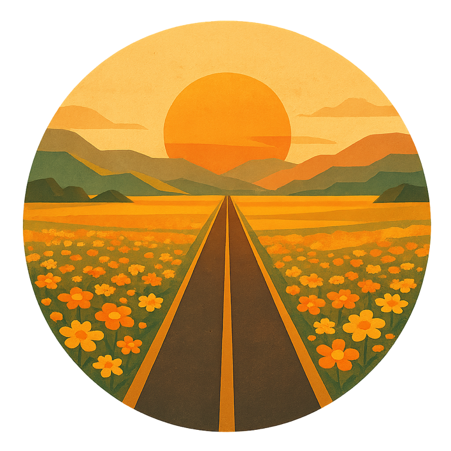

# Bloom Road

A meditative browser drive through endless changing country.
Studio Ghibli × Monument Valley × retro 1970s travel poster.



## Run

```sh
npm install
npm run dev      # http://localhost:5173
npm run build    # production bundle in dist/
```

## Controls

- **← / →** (or A / D, or drag) — drift across the road
- **M** — mute, **R** — hide/show the radio

There is no score, no timer, no fail state. Just the road, the music —
and the dashboard radio.

## The radio

A retro walnut head unit at the bottom of the screen tunes the whole world:

- **Stations = landscapes.** 88.1 FIELDS · 92.5 HIGHLANDS · 96.8 DESERT ·
  101.3 SKYLINE · 105.9 DOWNTOWN. Tune manually or hit **SCAN** and let the
  radio wander. The new country always morphs in smoothly down the road,
  and each station plays its own chord set.
- **TIME** row — dawn / day / dusk / night, or AUTO for a full day cycle
  (~5 minutes). The sun arcs across the sky, stars and headlights come out
  at night, the city windows light up.
- **WEATHER** row — clear / clouds / fog / rain / snow / storm, or AUTO,
  where changes land on chord boundaries. Rain hisses in the mix, thunder
  follows the lightning, fog muffles the music, snow settles on the ground.
- **CRUISE** knob — four speeds; the tempo of the music follows the car.
- **VOL** knob — drag or scroll; click to mute.

Everything eases between states on its own — the radio only sets the destination.

## How it works

- **Environment** ([src/environment.js](src/environment.js)) — central state for time of day,
  weather and landscape. Time-of-day palettes blend continuously; weather is a smoothed
  weight vector; landscapes are keyframes along the road's arc length so chunks ahead
  are built in the new style (a manual tune rebuilds the far chunks behind the fog).
- **World** ([src/world.js](src/world.js)) — the road centerline is integrated from a smooth
  curvature function; terrain, flowers (instanced billboards with a wind-sway shader),
  trees, cacti, rocks, buildings and streetlights are generated in ~134 m chunks ahead
  of the car and disposed behind it. Terrain shape and palette follow the landscape
  weights: ridges and snowcaps in the highlands, dunes in the desert, flat pavement downtown.
- **Sky** ([src/sky.js](src/sky.js)) — parametric gradient dome (palette, sun/moon, stars,
  storm dimming, lightning flash) plus a silhouette skyline band on the horizon that
  lights its windows at night.
- **Weather FX** ([src/weather.js](src/weather.js)) — rain streaks and snow recycled around
  the camera; lightning strikes prefer the beat and roll thunder into the music.
- **Music** ([src/audio.js](src/audio.js)) — generative city-pop ambient on raw Web Audio.
  Each landscape has its own chord set (changes on chord boundaries), tempo follows the
  cruise knob, night darkens the pads, fog and snow lowpass the master bus, rain and wind
  are mixed by the weather. The beat pulse drives the flower sway, bloom strength and the
  radio's EQ bars.
- **Radio UI** ([src/radio.js](src/radio.js)) — DOM/CSS head unit; markup in
  [index.html](index.html).
- **Post** ([src/post.js](src/post.js)) — soft bloom, ACES tone mapping, film grain + vignette.

## Assets

Flower sprites, the cloud and the title emblem were generated with the OpenAI Images API
(gpt-image): `OPENAI_API_KEY=... node tools/generate-assets.mjs`.
If the files are missing, the game falls back to procedural canvas sprites.
The skyline, rain, snow and shadow textures are procedural canvases.

---

Crafted at [befairlab.com](https://befairlab.com/)
